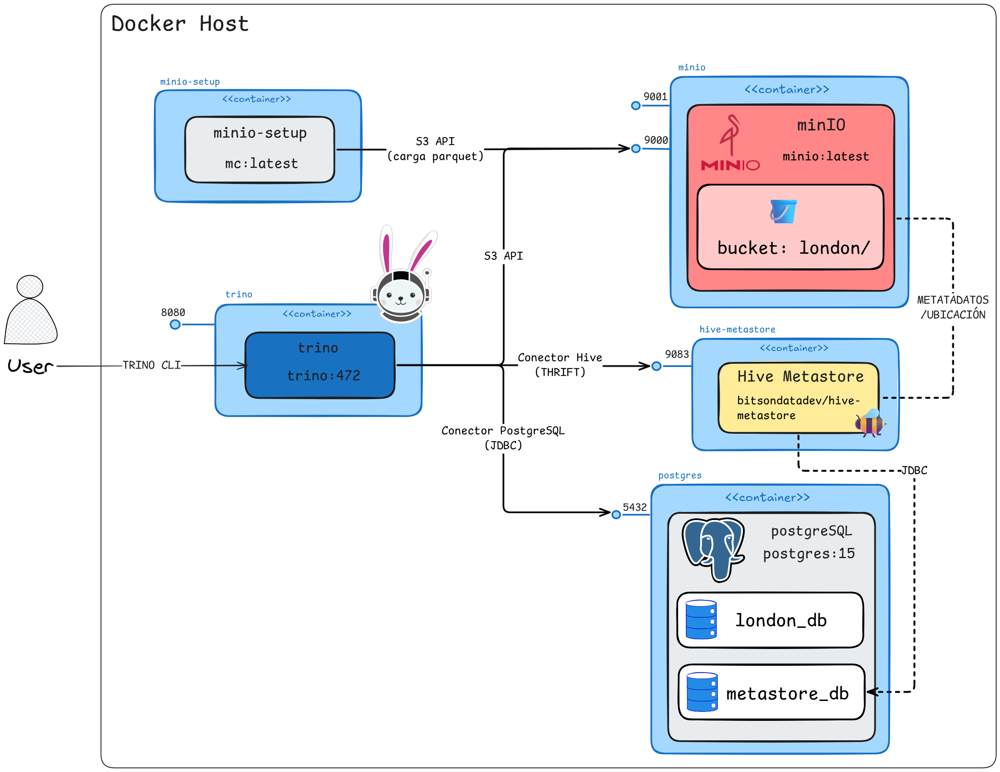
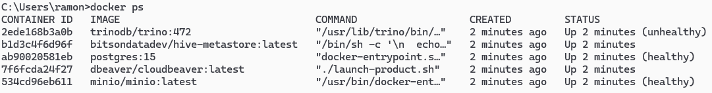
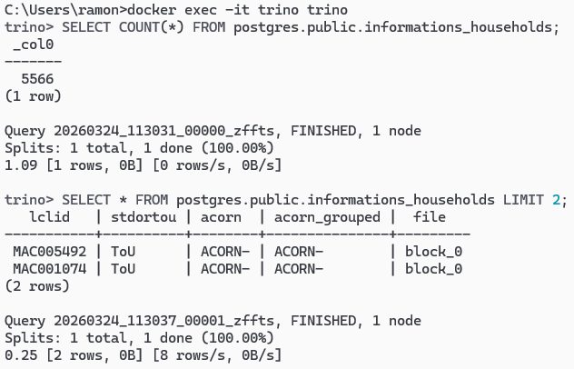
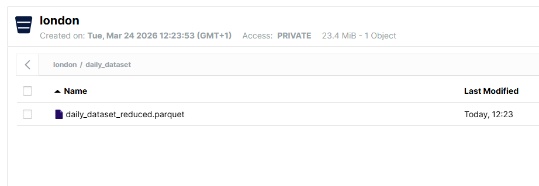
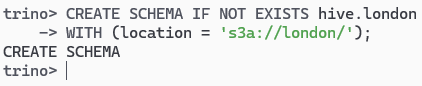
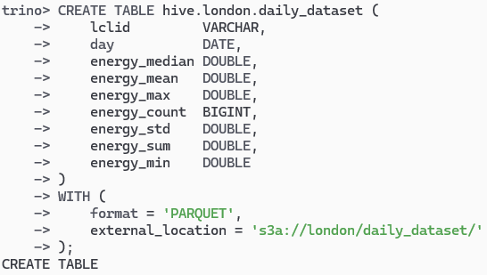
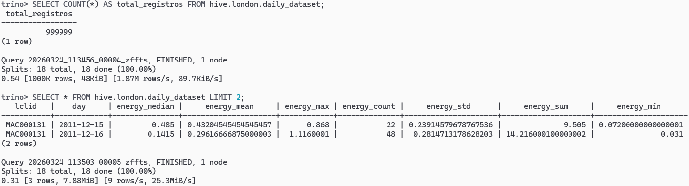
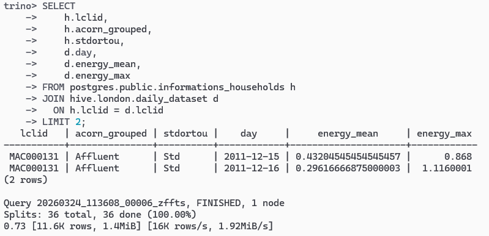

## INTRODUCCIÓN

### Objetivo

Esta práctica tiene como objetivo desplegar un entorno de consultas federadas con Trino, conectándose con dos fuentes de datos: una base de datos relacional PostgreSQL y un Data Lake basado en MinIO con ficheros en formato Parquet.

El dataset utilizado es [Smart Meters in London](https://www.kaggle.com/datasets/jeanmidev/smart-meters-in-london?select=informations_households.csv), disponible en Kaggle, que recoge el consumo eléctrico de más de 5.000 hogares londinenses entre 2012 y 2014.

La información está dividida en dos conjuntos de datos, y ahí reside la clave de la práctica, ya que viven en sistemas completamente distintos:

- `informations_households.csv`: metadatos descriptivos de cada hogar. Este archivo se encuentra almacenado en una base de datos PostgreSQL.
- `daily_dataset_reduced.parquet`: consumo eléctrico diario agregado por hogar (mediana, media, máximo...). Este archivo se encuentra almacenado en MinIO.

**Trino** nos permite consultar ambos conjuntos de datos como si estuvieran en una única base de datos, utilizando sentencias SQL estándar.

---

## ARQUITECTURA

### Diagrama general

El sistema está orquestado por **Docker Compose**, que permite desplegar todos los contenedores necesarios para el funcionamiento del ecosistema, el siguiente diagrama muestra la arquitectura del sistema:



*Fuente: Excalidraw — Elaboración propia.*

### Componentes del ecosistema

| Contenedor | Imagen | Puerto(s) | Función |
|---|---|---|---|
| **Trino** | `trinodb/trino:472` | `8080` | Motor de consultas federadas. Punto central que conecta todas las fuentes |
| **PostgreSQL** | `postgres:15` | `5432` | Base de datos relacional. Almacena `london_db` (hogares) y `metastore_db` (catálogo Hive) |
| **Hive Metastore** | `bitsondatadev/hive-metastore` | `9083` | Catálogo de metadatos para las tablas Parquet almacenadas en MinIO |
| **MinIO** | `minio/minio:latest` | `9000`, `9001` | Object Storage compatible con S3. Almacena los ficheros Parquet |
| **MinIO Setup** | `minio/mc:latest` | — | Contenedor *one-shot*: crea el bucket `london` y sube el Parquet |
| **CloudBeaver** | `dbeaver/cloudbeaver:latest` | `8978` | Interfaz web para ejecutar consultas SQL contra Trino |

### Rol de `metastore_db`

PostgreSQL aloja **dos bases de datos** independientes dentro del mismo servidor:

| Base de datos | Contenido | Utilizada por |
|---|---|---|
| `london_db` | Datos reales de la práctica (tabla `informations_households`) | Trino, vía conector PostgreSQL |
| `metastore_db` | Catálogo interno de Hive Metastore (nombres de tablas, ubicaciones S3, esquemas de columnas…) | Hive Metastore internamente |

Se reutiliza el mismo servidor PostgreSQL para evitar levantar un contenedor de base de datos adicional. Ambas bases de datos son completamente independientes entre sí.

---

## DESPLIEGUE DEL ENTORNO

### Arranque con Docker Compose

Para desplegar todo el ecosistema con un solo comando:

```bash
docker compose up -d
```

Este comando levanta todos los contenedores en segundo plano. El orden de arranque está controlado por `depends_on` y `healthcheck`:

1. **PostgreSQL** y **MinIO** arrancan primero (ambos con healthcheck).
2. Una vez PostgreSQL está *healthy*, arranca **Hive Metastore**.
3. Una vez MinIO está *healthy*, arranca **MinIO Setup** (one-shot) y sube el Parquet al bucket.
4. Cuando Hive Metastore y PostgreSQL están listos, arranca **Trino**.

Para verificar que todos los contenedores están corriendo:

```bash
docker ps
```



Para detener y eliminar todo (incluyendo volúmenes de datos):

```bash
docker compose down -v
```

---

## CONFIGURACIÓN DE TRINO PARA CONSULTAR AMBAS FUENTES

Trino se configura mediante ficheros de propiedades que se montan como volumen desde `./trino/conf:/etc/trino`. En la subcarpeta `catalog/` se definen los **conectores**: cada fichero `.properties` representa una conexión a una fuente de datos.

### Conector PostgreSQL (`catalog/postgres.properties`)

Este conector permite a Trino consultar directamente la base de datos `london_db` de PostgreSQL:

```properties
connector.name=postgresql
connection-url=jdbc:postgresql://postgres:5432/london_db
connection-user=demo
connection-password=demo123
```

| Propiedad | Descripción |
|---|---|
| `connector.name` | Tipo de conector. Trino incluye el driver PostgreSQL de serie |
| `connection-url` | URL JDBC que apunta al contenedor `postgres` en el puerto `5432`, base de datos `london_db` |
| `connection-user` / `password` | Credenciales del usuario PostgreSQL definidas en el `docker-compose.yml` |

Con esta configuración, las tablas de `london_db` son accesibles en Trino bajo el catálogo `postgres`. Por ejemplo:

```sql
SELECT * FROM postgres.public.informations_households LIMIT 5;
```

### Conector Hive (`catalog/hive.properties`)

Este conector permite a Trino acceder a tablas registradas en Hive Metastore, cuyos datos residen como ficheros Parquet en MinIO (S3):

```properties
connector.name=hive

# Hive Metastore (Thrift)
hive.metastore.uri=thrift://hive-metastore:9083

# Activa el filesystem S3 nativo de Trino
fs.native-s3.enabled=true

# Configuración S3 / MinIO
s3.endpoint=http://minio:9000
s3.aws-access-key=minioadmin
s3.aws-secret-key=minioadmin
s3.path-style-access=true
s3.region=us-east-1

# Permite CREATE/DROP TABLE desde Trino
hive.non-managed-table-writes-enabled=true

# Lee columnas Parquet por nombre, no por posición
hive.parquet.use-column-names=true
```

| Propiedad | Descripción |
|---|---|
| `hive.metastore.uri` | Dirección del servicio Hive Metastore vía protocolo Thrift |
| `fs.native-s3.enabled` | Activa el cliente S3 nativo de Trino |
| `s3.endpoint` | URL del servicio MinIO (compatible con la API de Amazon S3) |
| `s3.path-style-access` | Necesario para MinIO, que no soporta *virtual-hosted-style* |
| `hive.non-managed-table-writes-enabled` | Permite crear tablas externas desde el CLI de Trino |
| `hive.parquet.use-column-names` | Mapea las columnas del Parquet por nombre y no por índice ordinal |

### Configuración de Hive Metastore (`hive-site.xml`)

El Hive Metastore necesita su propia configuración, que se monta como volumen desde `trino/conf/hive-site.xml`. Este fichero define:

1. **Conexión a la base de datos del catálogo** (`metastore_db` en PostgreSQL):
```xml
<property>
    <name>javax.jdo.option.ConnectionURL</name>
    <value>jdbc:postgresql://postgres:5432/metastore_db</value>
</property>
<property>
    <name>javax.jdo.option.ConnectionDriverName</name>
    <value>org.postgresql.Driver</value>
</property>
```

2. **Directorio warehouse** apuntando al bucket de MinIO:
```xml
<property>
    <name>hive.metastore.warehouse.dir</name>
    <value>s3a://london/</value>
</property>
```

3. **Configuración S3A** para que Hive Metastore pueda acceder a MinIO:
```xml
<property>
    <name>fs.s3a.endpoint</name>
    <value>http://minio:9000</value>
</property>
```

### Problemas con la imagen de Hive Metastore y soluciones aplicadas

La imagen `bitsondatadev/hive-metastore:latest` está diseñada originalmente para funcionar con **MySQL**. Para adaptarla a nuestro entorno con PostgreSQL, fue necesario resolver dos problemas en el `entrypoint` del contenedor:

**Problema 1: Driver JDBC de PostgreSQL ausente**

La imagen solo incluye el driver JDBC de MySQL (`com.mysql.cj.jdbc.Driver`). Al configurar la conexión hacia PostgreSQL, se obtenía `ClassNotFoundException: org.postgresql.Driver`. La solución fue descargar el JAR del driver de PostgreSQL al arrancar el contenedor:

```bash
wget -q -O /opt/apache-hive-metastore-3.0.0-bin/lib/postgresql-42.6.0.jar \
  https://jdbc.postgresql.org/download/postgresql-42.6.0.jar
```

**Problema 2: JARs de Hadoop-AWS ausentes para S3A**

Al definir el warehouse directory como `s3a://london/`, el Metastore necesita acceder a MinIO mediante el sistema de ficheros S3A de Hadoop. La imagen no incluye los JARs necesarios (`hadoop-aws` y `aws-java-sdk-bundle`), produciendo `ClassNotFoundException: S3AFileSystem`. Se descargan al arrancar:

```bash
wget -q -O .../lib/hadoop-aws-3.2.0.jar \
  https://repo1.maven.org/maven2/org/apache/hadoop/hadoop-aws/3.2.0/hadoop-aws-3.2.0.jar
wget -q -O .../lib/aws-java-sdk-bundle-1.11.375.jar \
  https://repo1.maven.org/maven2/com/amazonaws/aws-java-sdk-bundle/1.11.375/aws-java-sdk-bundle-1.11.375.jar
```

---

## CARGA DE `informations_households.csv` EN POSTGRESQL

La carga de datos del CSV en PostgreSQL se realiza de forma **automática** durante el primer arranque del contenedor, gracias al script `postgres/init.sql` que se monta en el directorio de inicialización de la imagen oficial de PostgreSQL.

### Script `postgres/init.sql`

```sql
-- Se ejecuta solo la primera vez que se inicializa el volumen de Postgres.

-- ── Metastore de Hive ─────────────────────────────────────────────────────
CREATE DATABASE metastore_db;
GRANT ALL PRIVILEGES ON DATABASE metastore_db TO demo;

-- ── Datos de hogares ──────────────────────────────────────────────────────
CREATE DATABASE london_db;
GRANT ALL PRIVILEGES ON DATABASE london_db TO demo;

\connect london_db

CREATE TABLE informations_households (
    lclid         VARCHAR(20)  PRIMARY KEY,
    stdortou      VARCHAR(10),
    acorn         VARCHAR(20),
    acorn_grouped VARCHAR(30),
    file          VARCHAR(20)
);

\copy informations_households(lclid, stdortou, acorn, acorn_grouped, file)
  FROM '/docker-entrypoint-initdb.d/data/informations_households.csv'
  WITH (FORMAT csv, HEADER true)
```

### Descripción de las columnas

| Columna | Descripción |
|---|---|
| `lclid` | Identificador único del hogar |
| `stdortou` | Tipo de tarifa eléctrica (Standard or Time of Use) |
| `acorn` | Clasificación ACORN detallada del hogar |
| `acorn_grouped` | Clasificación ACORN agrupada: Affluent, Comfortable, Adversity |
| `file` | Nombre del fichero Parquet |

### ¿Cómo funciona?

1. El fichero `init.sql` se monta en `/docker-entrypoint-initdb.d/` del contenedor PostgreSQL.
2. El directorio `data/` (que contiene el CSV) se monta en `/docker-entrypoint-initdb.d/data/` en modo lectura (`:ro`).
3. La imagen oficial de PostgreSQL ejecuta automáticamente cualquier fichero `.sql` de ese directorio **solo la primera vez** que se inicializa el volumen `pg-data`.
4. El script crea las dos bases de datos (`metastore_db` y `london_db`), la tabla `informations_households` y carga el CSV con `\copy`.


### Verificación

Una vez levantado el ecosistema, se puede verificar la carga conectándose a Trino:

```bash
docker exec -it trino trino
```

```sql
SELECT COUNT(*) FROM postgres.public.informations_households;
```

```sql
SELECT * FROM postgres.public.informations_households LIMIT 2;
```



---

## ALMACENAMIENTO DE `daily_dataset_reduced.parquet` EN MINIO Y REGISTRO EN HIVE

### Paso 1. Carga automática del fichero Parquet en MinIO

La subida del fichero Parquet a MinIO es automática gracias al contenedor *one-shot* `minio-setup`. Al arrancar el ecosistema, este contenedor:

1. Configura un alias para conectarse a MinIO.
2. Crea el bucket `london` (si no existe).
3. Copia el fichero `daily_dataset_reduced.parquet` dentro del bucket, en la ruta `london/daily_dataset/`.

```bash
mc alias set local http://minio:9000 minioadmin minioadmin &&
mc mb --ignore-existing local/london &&
mc cp /data/daily_dataset_reduced.parquet local/london/daily_dataset/daily_dataset_reduced.parquet
```

Este paso se ejecuta automáticamente. Se puede verificar accediendo a la consola web de MinIO en `http://localhost:9001` (usuario: `minioadmin`, contraseña: `minioadmin`).



### Paso 2. Crear el esquema `london` en Hive (desde Trino)

A diferencia de PostgreSQL, donde los datos se cargan automáticamente, en el caso de Hive Metastore es necesario **registrar manualmente la tabla** para que Trino sepa qué estructura tiene el fichero Parquet y dónde encontrarlo.

Primero, nos conectamos al CLI de Trino:

```bash
docker exec -it trino trino
```

Creamos el esquema (equivalente a una base de datos) `london` dentro del catálogo `hive`:

```sql
CREATE SCHEMA IF NOT EXISTS hive.london
WITH (location = 's3a://london/');
```



### Paso 3. Crear la tabla externa `daily_dataset`

A continuación, creamos la tabla `daily_dataset` como una **tabla externa** (*external table*). Esto significa que la tabla apunta a datos que ya existen en MinIO; no se copian ni se mueven. Si se elimina la tabla con `DROP TABLE`, solo se elimina el registro del catálogo, **los datos Parquet permanecen intactos en MinIO**.

Es fundamental que los tipos de las columnas coincidan exactamente con los tipos almacenados en el fichero Parquet:

```sql
CREATE TABLE hive.london.daily_dataset (
    lclid         VARCHAR,
    day           DATE,
    energy_median DOUBLE,
    energy_mean   DOUBLE,
    energy_max    DOUBLE,
    energy_count  BIGINT,
    energy_std    DOUBLE,
    energy_sum    DOUBLE,
    energy_min    DOUBLE
)
WITH (
    format = 'PARQUET',
    external_location = 's3a://london/daily_dataset/'
);
```



### Descripción de las columnas

| Columna | Tipo | Descripción |
|---|---|---|
| `lclid` | `VARCHAR` | Identificador del hogar (clave de unión con `informations_households`) |
| `day` | `DATE` | Fecha del registro de consumo |
| `energy_median` | `DOUBLE` | Mediana del consumo kWh del día |
| `energy_mean` | `DOUBLE` | Media del consumo kWh del día |
| `energy_max` | `DOUBLE` | Máximo consumo kWh registrado en el día |
| `energy_count` | `BIGINT` | Número de lecturas del día |
| `energy_std` | `DOUBLE` | Desviación estándar del consumo |
| `energy_sum` | `DOUBLE` | Suma total del consumo kWh del día |
| `energy_min` | `DOUBLE` | Mínimo consumo kWh registrado en el día |

### Paso 4. Verificación

Verificamos que la tabla se ha registrado correctamente y que los datos son accesibles:

```sql
-- Contar registros totales
SELECT COUNT(*) AS total_registros FROM hive.london.daily_dataset;
```

```sql
-- Ver las primeras filas
SELECT * FROM hive.london.daily_dataset LIMIT 2;
```



### Verificación de consulta federada (JOIN entre ambas fuentes)

La verdadera potencia del ecosistema reside en poder cruzar datos de PostgreSQL y MinIO en una sola consulta SQL:

```sql
SELECT
    h.lclid,
    h.acorn_grouped,
    h.stdortou,
    d.day,
    d.energy_mean,
    d.energy_max
FROM postgres.public.informations_households h
JOIN hive.london.daily_dataset d
  ON h.lclid = d.lclid
LIMIT 10;
```

Esta consulta realiza un **JOIN federado**: Trino obtiene los datos de `informations_households` desde PostgreSQL y los datos de `daily_dataset` desde MinIO (vía Hive Metastore), combinándolos de forma transparente en un único resultado.



---

## CONSULTAS DE ANÁLISIS

La siguiente sección muestra la potencia del ecosistema desplegado, realizando consultas que combinan ambas fuentes de datos para extraer conclusiones sobre el comportamiento energético de los hogares londinenses. Todas las consultas que incluyen un JOIN entre `postgres.public.informations_households` y `hive.london.daily_dataset` son **consultas federadas**: Trino obtiene los datos de cada fuente por separado y los combina en memoria de forma transparente para el usuario.

### Conceptos clave

Antes de comenzar con las consultas, es importante entender dos conceptos que aparecen de forma recurrente en los datos:

**Clasificación ACORN**: sistema de segmentación socioeconómica utilizado en el Reino Unido que clasifica los hogares según su perfil demográfico y estilo de vida. En nuestro dataset, los hogares se agrupan en tres categorías principales: *Affluent* (alto poder adquisitivo), *Comfortable* (clase media) y *Adversity* (bajo poder adquisitivo).

**Tipo de tarifa eléctrica (`stdortou`)**: cada hogar tiene asignada una de dos tarifas. La tarifa `Std` (Standard) cobra un precio fijo por kWh independientemente de la hora del día. La tarifa `ToU` (Time of Use) varía el precio según la franja horaria, cobrando más en horas punta para incentivar el consumo en momentos de menor demanda.

---

### Consulta 1. Distribución de hogares por grupo socioeconómico y tarifa

Esta primera consulta opera únicamente sobre PostgreSQL y sirve como punto de partida para entender la composición del dataset antes de cruzarlo con los datos de consumo.

```sql
SELECT
    acorn_grouped,
    stdortou,
    COUNT(*) AS num_hogares
FROM postgres.public.informations_households
GROUP BY acorn_grouped, stdortou
ORDER BY acorn_grouped, stdortou;
```

**Resultado:**

| acorn_grouped | stdortou | num_hogares |
|---|---|---|
| ACORN-U | ToU | 2 |
| ACORN-U | Std | 39 |
| Adversity | Std | 1518 |
| Adversity | ToU | 298 |
| Affluent | Std | 1702 |
| Affluent | ToU | 490 |
| Comfortable | Std | 1184 |
| Comfortable | ToU | 323 |

**Análisis:** El grupo más numeroso es *Affluent* con 2.192 hogares, seguido de *Adversity* (1.816) y *Comfortable* (1.507). En todos los grupos, la tarifa estándar es mayoritaria (~77% de los hogares). El grupo `ACORN-U` tiene un tamaño marginal (41 hogares) y se descartará del resto del análisis.

---

### Consulta 2. Consumo medio diario por grupo socioeconómico (JOIN federado)

Primera consulta federada: combina los metadatos de hogares en PostgreSQL con los datos de consumo diario en MinIO.

```sql
SELECT
    h.acorn_grouped,
    COUNT(DISTINCT h.lclid)      AS num_hogares,
    ROUND(AVG(d.energy_mean), 4) AS kwh_medio_dia,
    ROUND(AVG(d.energy_max),  4) AS pico_kwh,
    ROUND(AVG(d.energy_min),  4) AS valle_kwh
FROM postgres.public.informations_households h
JOIN hive.london.daily_dataset d ON h.lclid = d.lclid
GROUP BY h.acorn_grouped
ORDER BY kwh_medio_dia DESC;
```

**Resultado:**

| acorn_grouped | num_hogares | kwh_medio_dia | pico_kwh | valle_kwh |
|---|---|---|---|---|
| Affluent | 550 | 0.2354 | 0.9059 | 0.0659 |
| Comfortable | 450 | 0.2007 | 0.7912 | 0.0566 |
| Adversity | 546 | 0.1734 | 0.7369 | 0.0449 |

**Análisis:** Se confirma una correlación directa entre nivel socioeconómico y consumo eléctrico. Los hogares *Affluent* consumen un **35,8% más** que los *Adversity*. Esta diferencia se mantiene tanto en el pico como en el valle, lo que apunta a un consumo estructuralmente mayor en los hogares más acomodados (viviendas más grandes, más dispositivos eléctricos).

---

### Consulta 3. Efecto de la tarifa ToU sobre el consumo (JOIN federado)

¿Tiene la tarifa Time of Use un efecto real sobre el comportamiento de los hogares?

```sql
SELECT
    h.stdortou,
    COUNT(DISTINCT h.lclid)                         AS num_hogares,
    ROUND(AVG(d.energy_mean), 4)                    AS kwh_medio_dia,
    ROUND(AVG(d.energy_max),  4)                    AS consumo_pico,
    ROUND(AVG(d.energy_min),  4)                    AS consumo_valle,
    ROUND(AVG(d.energy_max) - AVG(d.energy_min), 4) AS variabilidad
FROM postgres.public.informations_households h
JOIN hive.london.daily_dataset d ON h.lclid = d.lclid
GROUP BY h.stdortou;
```

**Resultado:**

| stdortou | num_hogares | kwh_medio_dia | consumo_pico | consumo_valle | variabilidad |
|---|---|---|---|---|---|
| Std | 1234 | 0.2063 | 0.8228 | 0.0563 | 0.7666 |
| ToU | 328 | 0.1955 | 0.7833 | 0.0541 | 0.7292 |

**Análisis:** Los hogares con tarifa ToU consumen un **5,2% menos** y presentan menor variabilidad entre pico y valle. La tarifa parece cumplir parcialmente su objetivo: los hogares tienden a suavizar su consumo, reduciendo los picos. La diferencia es moderada, lo que podría indicar que el incentivo funciona pero de forma limitada.

---

### Consulta 4. Top 10 hogares con mayor consumo total (JOIN federado)

Identificamos los hogares más consumidores de todo el periodo, cruzando su consumo acumulado con su perfil socioeconómico.

```sql
SELECT
    h.lclid,
    h.acorn_grouped,
    h.stdortou,
    ROUND(SUM(d.energy_sum), 2) AS kwh_total
FROM postgres.public.informations_households h
JOIN hive.london.daily_dataset d ON h.lclid = d.lclid
GROUP BY h.lclid, h.acorn_grouped, h.stdortou
ORDER BY kwh_total DESC
LIMIT 10;
```

**Resultado:**

| lclid | acorn_grouped | stdortou | kwh_total |
|---|---|---|---|
| MAC000985 | Affluent | ToU | 43031.15 |
| MAC002213 | Affluent | Std | 34142.61 |
| MAC003507 | Comfortable | Std | 33428.06 |
| MAC000049 | Affluent | Std | 30087.10 |
| MAC002441 | Affluent | Std | 29781.67 |
| MAC005393 | Affluent | Std | 28332.28 |
| MAC003979 | Comfortable | Std | 26972.95 |
| MAC004863 | Affluent | Std | 26884.63 |
| MAC004636 | Comfortable | Std | 26116.86 |
| MAC005041 | Affluent | Std | 25647.59 |

**Análisis:** El hogar `MAC000985` lidera con 43.031 kWh acumulados, muy por encima del segundo (34.142 kWh). Llama la atención que tenga tarifa **ToU**: a pesar del incentivo económico, su consumo total es el más alto del dataset. Esto sugiere que cuando la demanda es estructuralmente alta, la tarifa variable no basta para modificar el comportamiento. El top 10 está dominado por hogares *Affluent*, confirmando el patrón de la consulta 2.

---

### Consulta 5. Evolución mensual del consumo (estacionalidad)

Esta consulta opera únicamente sobre el Parquet en MinIO y muestra cómo evoluciona el consumo a lo largo de los meses (noviembre 2011 a febrero 2014).

```sql
SELECT
    date_trunc('month', d.day)   AS mes,
    ROUND(AVG(d.energy_mean), 4) AS kwh_medio_dia,
    ROUND(AVG(d.energy_max),  4) AS pico_kwh
FROM hive.london.daily_dataset d
GROUP BY date_trunc('month', d.day)
ORDER BY mes;
```

**Resultado (selección):**

| mes | kwh_medio_dia | pico_kwh |
|---|---|---|
| 2011-12-01 | 0.2669 | 1.0088 |
| 2012-01-01 | 0.2661 | 1.0510 |
| 2012-07-01 | 0.1682 | 0.7008 |
| 2012-08-01 | 0.1644 | 0.6702 |
| 2013-01-01 | 0.2537 | 0.9585 |
| 2013-07-01 | 0.1611 | 0.6433 |
| 2013-08-01 | 0.1585 | 0.6381 |
| 2014-02-01 | 0.2227 | 0.8605 |

**Análisis:** El patrón estacional es muy claro. El consumo en invierno casi dobla al de verano: el mínimo es agosto 2013 (0,1585 kWh/día) y el máximo enero 2012 (0,2661 kWh/día), una diferencia del **68%**. Esto es esperable en Londres, donde la calefacción eléctrica y los días más cortos en invierno elevan significativamente el consumo.

---

### Consulta 6. Búsqueda de hogares con consumo anómalo (JOIN federado)

Intentamos localizar hogares con un consumo medio diario superior a 1,5 kWh, umbral establecido como indicador de consumo anómalo.

```sql
SELECT
    h.lclid,
    h.acorn_grouped,
    h.stdortou,
    ROUND(AVG(d.energy_mean), 4) AS kwh_medio_dia,
    ROUND(AVG(d.energy_max),  4) AS pico_kwh
FROM postgres.public.informations_households h
JOIN hive.london.daily_dataset d ON h.lclid = d.lclid
GROUP BY h.lclid, h.acorn_grouped, h.stdortou
HAVING AVG(d.energy_mean) > 1.5
ORDER BY kwh_medio_dia DESC;
```

**Resultado:** 0 filas.

**Análisis:** No hay ningún hogar con una media diaria superior a 1,5 kWh. Como vimos en la consulta 2, el grupo más consumidor (*Affluent*) tiene una media de 0,2354 kWh/día. Los hogares del top 10 acumulan su alto consumo total a lo largo de muchos días, no porque sus picos diarios sean extremos. Esto indica que el dataset no contiene consumidores industriales ni errores de medición: los outliers son relativos dentro de un rango compacto.

---

### Consulta 7. Consumo y variabilidad por grupo social y tarifa (JOIN federado)

Consulta que cruza las dos dimensiones principales del análisis (grupo socioeconómico y tipo de tarifa) para obtener una visión completa de cada segmento.

```sql
SELECT
    h.acorn_grouped,
    h.stdortou,
    COUNT(DISTINCT h.lclid)                         AS num_hogares,
    ROUND(AVG(d.energy_mean), 4)                    AS kwh_medio_dia,
    ROUND(AVG(d.energy_max) - AVG(d.energy_min), 4) AS variabilidad
FROM postgres.public.informations_households h
JOIN hive.london.daily_dataset d ON h.lclid = d.lclid
GROUP BY h.acorn_grouped, h.stdortou
ORDER BY h.acorn_grouped, h.stdortou;
```

**Resultado:**

| acorn_grouped | stdortou | num_hogares | kwh_medio_dia | variabilidad |
|---|---|---|---|---|
| Adversity | Std | 440 | 0.1778 | 0.7030 |
| Adversity | ToU | 106 | 0.1548 | 0.6456 |
| Affluent | Std | 445 | 0.2372 | 0.8498 |
| Affluent | ToU | 105 | 0.2280 | 0.8000 |
| Comfortable | Std | 337 | 0.2001 | 0.7339 |
| Comfortable | ToU | 113 | 0.2027 | 0.7367 |

**Análisis:** El efecto de la tarifa ToU es consistente en *Adversity* y *Affluent*, donde los hogares ToU consumen menos y con menor variabilidad. Sin embargo, en *Comfortable* el comportamiento se invierte: los hogares ToU consumen marginalmente más (0,2027 vs 0,2001 kWh/día). El hallazgo más claro es que **la tarifa ToU reduce la variabilidad en todos los grupos**, confirmando que consigue suavizar los picos de consumo aunque su efecto sobre el consumo total no sea uniforme.
