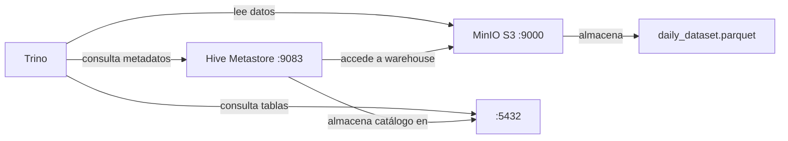

# 🛠️ Problemas y soluciones: Configuración de Hive Metastore con PostgreSQL y MinIO (S3)

> **Fecha**: 23 de marzo de 2026  
> **Contexto**: Ecosistema Docker con Trino, Hive Metastore, PostgreSQL y MinIO (S3). La imagen base utilizada es `bitsondatadev/hive-metastore:latest`, que por defecto está preparada para funcionar con MySQL.

---

## Resumen de la arquitectura



---

## Problema 1 — `Unrecognized option: --ifNotExists`

### Síntoma
```
HiveSchemaTool:Parsing failed.  Reason: Unrecognized option: --ifNotExists
```
El contenedor `hive-metastore` se apagaba inmediatamente tras arrancar.

### Causa
En el `entrypoint` del `docker-compose.yml` se usaba el flag `--ifNotExists` en el comando `schematool`, pero **esa opción no existe en la versión de Hive Metastore 3.0.0** incluida en la imagen. Al fallar el comando (encadenado con `&&`), todo el script se detenía y el contenedor moría.

### Solución
Sustituir `--ifNotExists` por una lógica condicional que primero comprueba si el esquema ya existe (`-info`) y, solo si falla, lo inicializa (`-initSchema`):

```diff
- /opt/apache-hive-metastore-3.0.0-bin/bin/schematool -dbType postgres -initSchema --ifNotExists &&
+ (/opt/apache-hive-metastore-3.0.0-bin/bin/schematool -dbType postgres -info || /opt/apache-hive-metastore-3.0.0-bin/bin/schematool -dbType postgres -initSchema) &&
```

> [!TIP]
> El operador `||` en shell significa: "si el comando de la izquierda falla, ejecuta el de la derecha". Así, `-info` falla cuando no hay esquema → se ejecuta `-initSchema`. Si ya existe el esquema → `-info` tiene éxito y se salta `-initSchema`.

---

## Problema 2 — Conexión JDBC apuntando a MySQL en lugar de PostgreSQL

### Síntoma
```
Metastore connection URL:    jdbc:mysql://mysql-metastore:3306/metastore_db?useSSL=false&allowPublicKeyRetrieval=true
Metastore Connection Driver: com.mysql.cj.jdbc.Driver

com.mysql.cj.jdbc.exceptions.CommunicationsException: Communications link failure
```
El Metastore seguía intentando conectar a un MySQL inexistente, a pesar de que en el `docker-compose.yml` las variables de entorno apuntaban a PostgreSQL.

### Causa
El archivo **`trino/conf/hive-site.xml`** (montado como volumen en el contenedor) tenía configurados el `ConnectionURL` y el `ConnectionDriverName` para MySQL. Este archivo XML **sobrescribe** cualquier variable de entorno, ya que Hive lo lee directamente.

### Solución
Editar `trino/conf/hive-site.xml` para usar PostgreSQL:

```diff
- <!-- Conexión al metastore DB (MySQL) -->
+ <!-- Conexión al metastore DB (PostgreSQL) -->
  <property>
    <name>javax.jdo.option.ConnectionURL</name>
-   <value>jdbc:mysql://mysql-metastore:3306/metastore_db?useSSL=false&amp;allowPublicKeyRetrieval=true</value>
+   <value>jdbc:postgresql://postgres:5432/metastore_db</value>
  </property>
  <property>
    <name>javax.jdo.option.ConnectionDriverName</name>
-   <value>com.mysql.cj.jdbc.Driver</value>
+   <value>org.postgresql.Driver</value>
  </property>
```

> [!IMPORTANT]
> En Hive, el archivo `hive-site.xml` tiene prioridad sobre las variables de entorno. Si montas este archivo con volumen, **todo lo que esté ahí dentro manda**.

---

## Problema 3 — Driver JDBC de PostgreSQL no encontrado

### Síntoma
```
Failed to load driver
Underlying cause: java.lang.ClassNotFoundException: org.postgresql.Driver
```

### Causa
La imagen `bitsondatadev/hive-metastore:latest` **solo incluye el driver JDBC de MySQL** (`com.mysql.cj.jdbc.Driver`). Al cambiar la configuración a PostgreSQL, Java no encontraba la clase del driver.

### Solución
Descargar el JAR del driver PostgreSQL JDBC al arrancar el contenedor, añadiendo un `wget` al `entrypoint` del `docker-compose.yml`:

```yaml
wget -q -O /opt/apache-hive-metastore-3.0.0-bin/lib/postgresql-42.6.0.jar \
  https://jdbc.postgresql.org/download/postgresql-42.6.0.jar
```

---

## Problema 4 — Clase `S3AFileSystem` no encontrada

### Síntoma
```
MetaException(message:java.lang.ClassNotFoundException: Class org.apache.hadoop.fs.s3a.S3AFileSystem not found)
```
El Metastore se caía justo después de inicializar el esquema correctamente.

### Causa
En `hive-site.xml`, el `warehouse.dir` está configurado como `s3a://london/`. Al arrancar, el Metastore intenta validar esa ruta y necesita las clases del sistema de ficheros S3A. La imagen **no incluye** los JARs `hadoop-aws` ni `aws-java-sdk-bundle`.

### Solución
Añadir dos `wget` más al `entrypoint` para descargar los JARs necesarios (versiones compatibles con Hadoop 3.2.0 que incluye la imagen):

```yaml
wget -q -O /opt/apache-hive-metastore-3.0.0-bin/lib/hadoop-aws-3.2.0.jar \
  https://repo1.maven.org/maven2/org/apache/hadoop/hadoop-aws/3.2.0/hadoop-aws-3.2.0.jar

wget -q -O /opt/apache-hive-metastore-3.0.0-bin/lib/aws-java-sdk-bundle-1.11.375.jar \
  https://repo1.maven.org/maven2/com/amazonaws/aws-java-sdk-bundle/1.11.375/aws-java-sdk-bundle-1.11.375.jar
```

> [!NOTE]
> La versión `aws-java-sdk-bundle-1.11.375` es la que se distribuye oficialmente con Hadoop 3.2.0. Usar una versión incompatible puede dar errores de firma o métodos no encontrados.

---

## Problema 5 — Tipo de columna incorrecto en la tabla Hive (`VARCHAR` vs `DATE`)

### Síntoma
```
Query failed: Unsupported Trino column type (varchar) for Parquet column ([day] optional int32 day (DATE))
```
La consulta `SELECT * FROM hive.london.daily_dataset LIMIT 10` fallaba, aunque `SELECT COUNT(*)` sí funcionaba.

### Causa
La tabla fue creada en Hive con la columna `day` como `VARCHAR`, pero en el archivo Parquet real, esa columna está almacenada como tipo `DATE` (int32 con anotación DATE). Trino detecta la incompatibilidad al intentar leer los datos de la columna.

> `COUNT(*)` funcionaba porque solo cuenta filas sin necesidad de leer el contenido de las columnas.

### Solución

> [!CAUTION]
> Esta corrección debe hacerse **antes de empezar a trabajar con las consultas**. Lo ideal es que el DDL de la tabla se defina correctamente desde el inicio.

Conectarse al CLI de Trino y recrear la tabla con los tipos correctos:

```sql
-- 1. Borrar la tabla mal definida (solo borra metadatos, NO el Parquet)
DROP TABLE hive.london.daily_dataset;

-- 2. Recrearla con los tipos que coinciden con el Parquet
CREATE TABLE hive.london.daily_dataset (
    lclid         VARCHAR,
    day           DATE,
    energy_median DOUBLE,
    energy_mean   DOUBLE,
    energy_max    DOUBLE,
    energy_count  BIGINT,
    energy_std    DOUBLE,
    energy_sum    DOUBLE,
    energy_min    DOUBLE
)
WITH (
    format = 'PARQUET',
    external_location = 's3a://london/daily_dataset/'
);
```

Después verificar:
```sql
SELECT * FROM hive.london.daily_dataset LIMIT 10;
```

> [!TIP]
> Al ser una tabla **EXTERNAL**, el `DROP TABLE` solo elimina el registro en el catálogo de Hive Metastore. Los datos Parquet en MinIO siguen intactos.

---

## Entrypoint final del `docker-compose.yml`

Tras todas las correcciones, el `entrypoint` del servicio `hive-metastore` queda así:

```yaml
hive-metastore:
  image: bitsondatadev/hive-metastore:latest
  container_name: hive-metastore
  depends_on:
    postgres:
      condition: service_healthy
  environment:
    METASTORE_DB_HOSTNAME: postgres
    METASTORE_DB_NAME: metastore_db
    METASTORE_DB_USER: demo
    METASTORE_DB_PASSWORD: demo123
  volumes:
    - ./trino/conf/hive-site.xml:/opt/apache-hive-metastore-3.0.0-bin/conf/hive-site.xml
  entrypoint: >
    /bin/sh -c "
      echo 'Downloading extra JARs...' &&
      wget -q -O /opt/apache-hive-metastore-3.0.0-bin/lib/postgresql-42.6.0.jar https://jdbc.postgresql.org/download/postgresql-42.6.0.jar &&
      wget -q -O /opt/apache-hive-metastore-3.0.0-bin/lib/hadoop-aws-3.2.0.jar https://repo1.maven.org/maven2/org/apache/hadoop/hadoop-aws/3.2.0/hadoop-aws-3.2.0.jar &&
      wget -q -O /opt/apache-hive-metastore-3.0.0-bin/lib/aws-java-sdk-bundle-1.11.375.jar https://repo1.maven.org/maven2/com/amazonaws/aws-java-sdk-bundle/1.11.375/aws-java-sdk-bundle-1.11.375.jar &&
      echo 'Waiting for postgres:5432...' &&
      while ! nc -z postgres 5432; do sleep 1; done &&
      (/opt/apache-hive-metastore-3.0.0-bin/bin/schematool -dbType postgres -info || /opt/apache-hive-metastore-3.0.0-bin/bin/schematool -dbType postgres -initSchema) &&
      exec /opt/apache-hive-metastore-3.0.0-bin/bin/start-metastore
    "
  ports:
    - "9083:9083"
```

---

---

## Problema 6 — Puerto 3306 hardcodeado en el script de espera de la imagen

### Síntoma
```
Waiting for database on postgres to launch on 3306 ...
```
El contenedor `hive-metastore` se quedaba bloqueado indefinidamente sin avanzar.

### Causa
El script de arranque de `bitsondatadev/hive-metastore` tiene hardcodeado `nc -z ${METASTORE_DB_HOSTNAME} 3306`, independientemente del puerto real configurado. Como PostgreSQL escucha en el **puerto 5432**, la comprobación nunca pasa y el contenedor cuelga para siempre.

### Solución
Sobreescribir el `entrypoint` en `docker-compose.yml` para hacer el wait en el puerto correcto y llamar directamente a los binarios de Hive:

```yaml
entrypoint: >
  /bin/sh -c "
    while ! nc -z postgres 5432; do sleep 1; done &&
    ...
    exec /opt/apache-hive-metastore-3.0.0-bin/bin/start-metastore
  "
```

> [!NOTE]
> Este problema aparece **antes** que el resto: aunque el contenedor muestre el hostname correcto (`postgres`), el puerto 3306 es fijo en el código de la imagen. La solución de sobreescribir el entrypoint es necesaria siempre que se use PostgreSQL con esta imagen.

---

## Problema 7 — Trino: `permission denied` al crear `/var/trino`

### Síntoma
```
ERROR: data dir is invalid: path /var/trino/data is invalid: mkdir /var/trino: permission denied
```
Trino no arrancaba.

### Causa
La imagen `trinodb/trino:472` ejecuta el proceso como usuario no-root por defecto. No tiene permisos para crear el directorio de datos en `/var/trino`.

### Solución
Añadir `user: root` al servicio `trino` en `docker-compose.yml`:

```yaml
trino:
  image: trinodb/trino:472
  user: root
  ...
```

---

## Problema 8 — Trino 472: propiedades `hive.s3.*` eliminadas

### Síntoma (primer intento)
```
Configuration property 'hive.s3.aws-access-key' was not used
Configuration property 'hive.s3.aws-secret-key' was not used
Configuration property 'hive.s3.endpoint' was not used
```

### Síntoma (segundo intento, con `s3.*`)
```
Configuration property 's3.aws-access-key' was not used
Configuration property 's3.endpoint' was not used
```

### Causa
En **Trino 472**, las antiguas propiedades `hive.s3.*` fueron completamente eliminadas. El nuevo sistema de ficheros nativo de Trino usa el prefijo `s3.*`, pero solo se activa si se declara explícitamente `fs.native-s3.enabled=true` en el fichero de catálogo. Sin esa línea, el módulo S3 no se carga y las propiedades quedan como "not used".

### Solución
En `trino/conf/catalog/hive.properties`:

```diff
- hive.s3.endpoint=http://minio:9000
- hive.s3.aws-access-key=minioadmin
- hive.s3.aws-secret-key=minioadmin
- hive.s3.path-style-access=true
- hive.s3.ssl.enabled=false
+ fs.native-s3.enabled=true
+ s3.endpoint=http://minio:9000
+ s3.aws-access-key=minioadmin
+ s3.aws-secret-key=minioadmin
+ s3.path-style-access=true
+ s3.region=us-east-1
```

> [!IMPORTANT]
> La línea `fs.native-s3.enabled=true` es necesaria para que Trino 472 cargue el módulo S3 y reconozca el resto de propiedades `s3.*`. Sin ella, aunque las propiedades estén bien escritas, Trino las ignora.

---

## Resumen rápido

| # | Problema | Archivo modificado | Causa raíz |
|---|----------|--------------------|------------|
| 1 | `Unrecognized option: --ifNotExists` | `docker-compose.yml` | Flag inexistente en schematool 3.0.0 |
| 2 | Conexión JDBC apunta a MySQL | `trino/conf/hive-site.xml` | `hive-site.xml` tenía URL y driver de MySQL |
| 3 | `ClassNotFoundException: org.postgresql.Driver` | `docker-compose.yml` | Imagen no incluye driver JDBC PostgreSQL |
| 4 | `ClassNotFoundException: S3AFileSystem` | `docker-compose.yml` | Imagen no incluye JARs hadoop-aws |
| 5 | `Unsupported column type varchar for DATE` | DDL en Trino CLI | Tabla creada con tipos incorrectos |
| 6 | Contenedor cuelga en `Waiting for... 3306` | `docker-compose.yml` | Puerto hardcodeado en imagen bitsondatadev |
| 7 | Trino: `permission denied` en `/var/trino` | `docker-compose.yml` | Imagen corre como non-root por defecto |
| 8 | Trino 472: propiedades S3 no reconocidas | `trino/conf/catalog/hive.properties` | API S3 cambió; necesita `fs.native-s3.enabled=true` |
